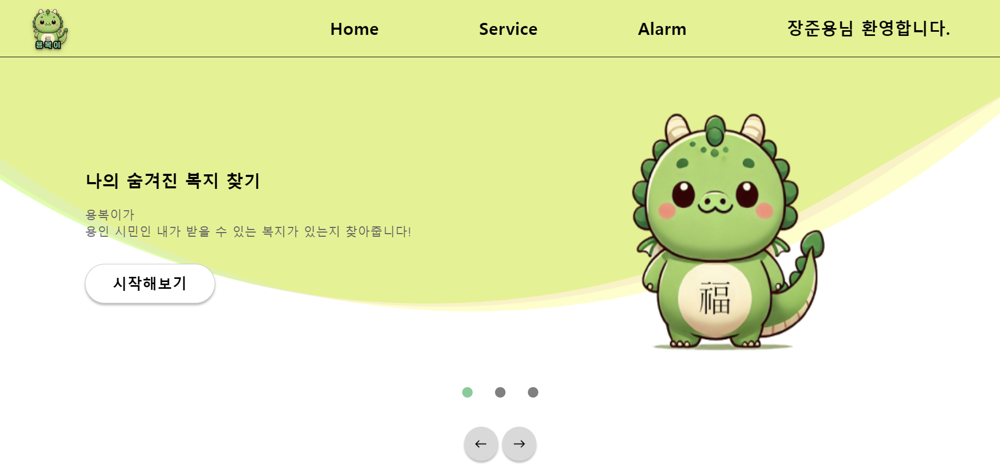
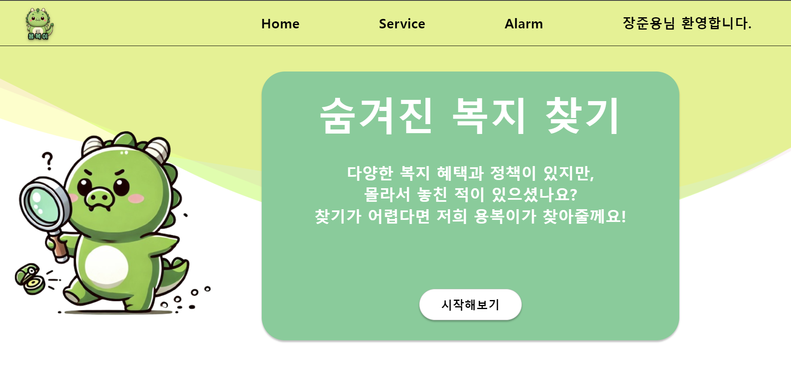
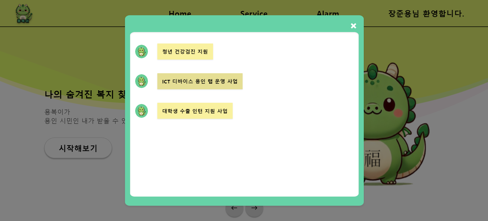

    
    

    
 
    
    <h2 style="border-bottom: 1px solid #d8dee4; color: #282d33;"> 용인에게 복을 전하는 이야기 </h2>  
    
 용복이는 Chat GPT, Chat GPT gpt assistants를 활용해, 용인 청년을 대상으로 한 복지 정책을 학습 시켜, 청년에게 맞춤형 서비스과 복지 추천을 제공하는 서비스 입니다!  
 
    

    

    <h2 style="border-bottom: 1px solid #d8dee4; color: #282d33;"> 🛠️ Tech Stacks </h2>   
    
 
          
          
          
          
           
          
          
          
          

    

## Collaborator
### 팀장 장준용

 [jainefer](https://github.com/jainefer)
 
 **백엔드** , **모델링** ,**서버**, **디자인** 

 ### 팀원 권상훈

 [sunsetdust](https://github.com/sunsetdust)

 **프론트엔드** , **기획** 

 ### 팀원 김원철

 [1FE](https://github.com/dnjscjf0829)

 **프론트엔드** ,**기획**

 ### 팀원 남병준

 [hardNormalEasyMode](https://github.com/dlrtmxmflaqudwnsdl)
 
 **백엔드**, **기획** , **디자인**

## 💡 Features

### 📌 메인 화면

- **용복이 소개 및 맞춤형 서비스 버튼**: 사용자가 메인 화면에서 용복이 서비스에 대한 소개를 보고, 맞춤형 서비스로 이동할 수 있는 버튼을 클릭할 수 있습니다.

### 📌 맞춤형 서비스 화면

- **개인화된 추천 서비스**: 사용자가 자신의 정보를 입력하면, AI가 입력된 정보를 바탕으로 가장 적합한 복지 정책을 추천합니다.
- **사용자 친화적 UI/UX**: 직관적이고 사용자가 쉽게 접근할 수 있는 인터페이스를 통해, 복지 정책 정보를 간편하게 확인할 수 있습니다.

### 📌 맞춤형 정책 알림

- **자동 스케줄링 및 크롤링**: 일주일마다 용인시 사이트를 자동으로 크롤링하여 새로운 복지 정책이 업데이트되었는지 확인합니다.
- **개인 맞춤형 알림**: 새로 업데이트된 정책이 있을 경우, 해당 정책에 적합한 유저를 AI가 자동으로 선별하여 알림을 보냅니다.
- **실시간 알림**: 사용자들은 새로운 복지 정책이 추가되었을 때, 실시간으로 알림을 받아볼 수 있습니다.

## 🎯 Usage

### 📚 기본 사용법

1. **메인 화면**에서 "숨겨진 복지 찾기" 버튼을 클릭해보세요.
2. **맞춤형 서비스 화면**에서 자신의 정보를 입력하세요.
3. AI가 추천하는 자신에게 맞는 **복지 정책**을 확인하세요.
4. 업데이트된 정책을 당신에게 적합한지 확인하고 **알림**을 보내드려요!
.

### 💬 Contact

프로젝트 관련 문의사항이나 제안사항이 있다면 아래로 연락주세요:

- Email: jy5849@gmail.com
- GitHub: [jainefer](https://github.com/jainefer)

## 👏 Acknowledgements

- 용복이 프로젝트는 [용인시 복지 정책](https://yongin.go.kr)의 데이터를 기반으로 학습된 AI 모델을 사용하고 있습니다.
- 이 프로젝트는 **OpenAI**의 GPT 모델을 활용하여 개인 맞춤형 복지 서비스를 제공합니다.

    

